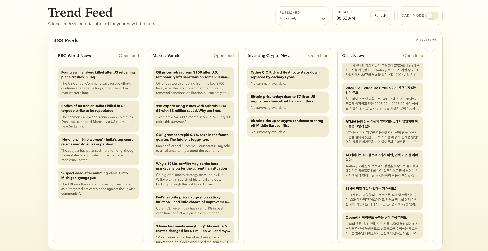
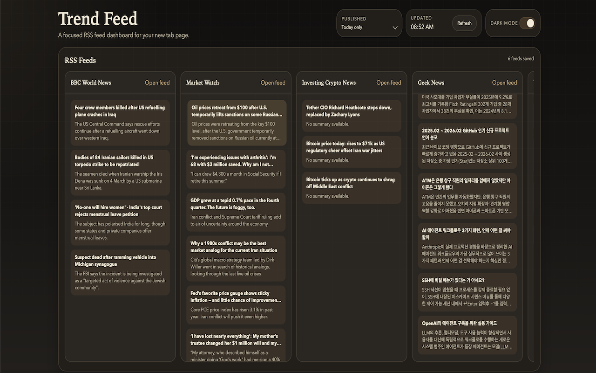

# Trend Feed

- [Chrome Web Store](https://chromewebstore.google.com/detail/ncnolinnebbkkjhcnhjihjfilnjchlib?utm_source=item-share-cb)
- [Demo Link](https://mschoi.com/trend-feed/)
- A browser extension for Chrome and Microsoft Edge that replaces the default new tab page with an RSS feed dashboard.


## Screenshot
- Default

- Dark mode


## Current scope

This starter is intentionally simple:

- Manifest V3 extension
- No build step
- New tab override
- Extension popup for adding and deleting RSS feed links
- `chrome.storage.local` for saved RSS feeds
- Client-side RSS XML fetching and rendering
- Responsive dashboard UI

## Supported feed formats

Trend Feed currently supports common XML feed shapes that expose entries with `item` or `entry` elements:

- RSS 2.0 feeds with `title`, `link`, `description`, and `pubDate`
- RSS 1.0/RDF feeds with `item`, `link` or `rdf:about`, `content:encoded`, and `dc:date`
- Atom feeds with `entry`, `title`, `link href`, `summary` or `content`, and `published` or `updated`

Live smoke coverage is included for:

- RSS 1.0/RDF: `https://equallove-2017.blog.jp/index.rdf`
- RSS 2.0: `https://hnrss.org/newest`
- Atom: `https://feeds.feedburner.com/geeknews-feed`
- RSS 2.0: `https://feeds.content.dowjones.io/public/rss/RSSMarketsMain`
- RSS 2.0: `https://www.investing.com/rss/news_301.rss`

## Tests

Run the live feed compatibility smoke test:

```sh
node --test test/feed-support.test.mjs
```

The test requires network access and `xmllint`.

## Release zips

Create a Chrome Web Store-ready zip:

```sh
./scripts/package-extension.sh
```

Create a Microsoft Edge Add-ons-ready zip:

```sh
./scripts/package-edge-extension.sh
```

The packages are written to `dist/trend-feed-v<manifest-version>.zip` and
`dist/trend-feed-edge-v<manifest-version>.zip`. Each includes only:

- `manifest.json`
- `newtab.html`
- `popup.html`
- `icons/`
- `src/`

The Edge package copies `manifest.edge.json` into the archive as `manifest.json`, as required by Microsoft Edge Add-ons. Keep the versions in both manifests synchronized.

When changes are pushed or merged to `main`, GitHub Actions reads the version from `manifest.json`, creates a matching `v<version>` tag, creates a GitHub Release, and attaches both zips. If that tag already exists, the workflow fails so the manifest version can be bumped before releasing.

## Load in Chrome

1. Open `chrome://extensions`
2. Enable Developer mode
3. Click Load unpacked
4. Select this project folder

## Load in Microsoft Edge

1. Run `./scripts/package-edge-extension.sh`
2. Open `edge://extensions`
3. Enable Developer mode
4. Click Load unpacked
5. Select the generated `dist/trend-feed-edge` folder

## Project structure

- `manifest.json`: Chrome extension manifest
- `manifest.edge.json`: Microsoft Edge extension manifest
- `newtab.html`: new tab entry page
- `src/newtab.js`: dashboard app logic
- `src/styles.css`: dashboard styles
